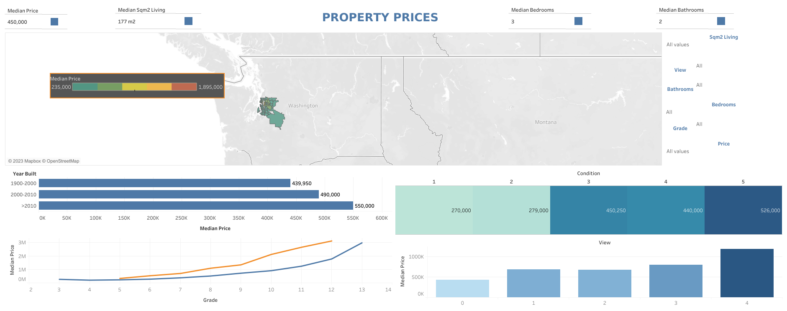
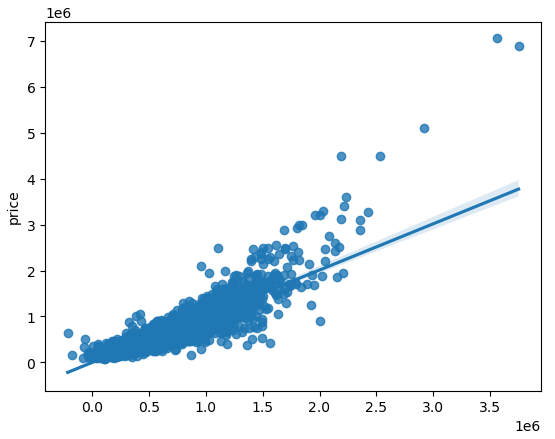
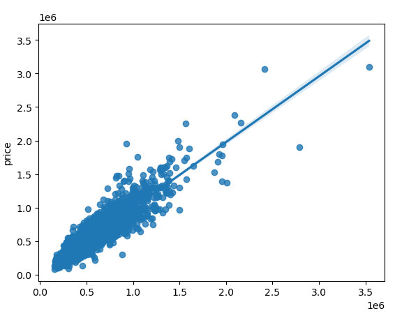
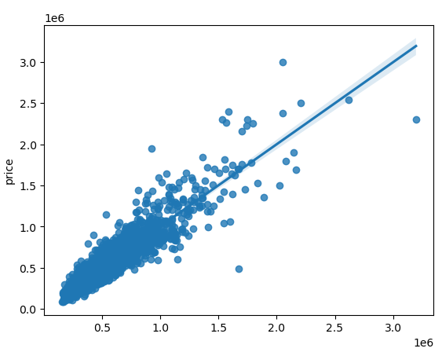

# Case study: Regression - Ironhack Mid bootcamp project

## Introduction
This project was prepared by the team of: **Athina, Iago and Olga** working together as analysts for a real estate company. **The objective** was to understand and analyse the features which determine the selling price of a house and to create a machine learning model which predicts those prices. 

This repository was created in order to present the results of our work. It consists of: 

1. **Dataset folder** - The dataset (available in the repository folder *dataset*) consists of information on 22,000 properties which were sold between May 2014 and May 2015. 
2. **Python code** - Jupyter Notebook file containing Python code with machine learning models
3. **SQL queries** - with required queries (to be used on the house_price_regression database) 
4. **A Tableau Dashboard** - dashboard contains answers to questions which were asked in the task. It also contains an interactive, easy to use dashboard which might help business stakeholders in analysing the data. 

Additionally, **the slide deck** for our project's presentation is available here: https://slides.com/ad-6/palette/review. 

## Tableau & dataset exploration
The Tableau dashboard enables analysis of various aspects related to house prices in the state of Washington:
 
    
- **Geographic Analysis**: Thanks to the interactive map, users can explore the geographical distribution of houses in different areas of the state. They can identify price concentration patterns, areas with higher or lower values, and discover regional trends in the real estate market.
Impact of House Features: The dashboard provides insights into how different house features, such as the number of bedrooms, bathrooms, size, and overall condition, influence the median price. Users can assess how these features affect property valuation.
- **Temporal Analysis**: Through the chart of construction years, users can study how the real estate market has evolved over time. This can help identify historical trends and understand how the age of houses impacts current prices.
- **Relationship between Views and Prices**: The chart of median price by views offers information on how scenic views affect property valuation. Users can determine whether views have a significant impact on house prices.
- **Influence of House Grade**: The chart of median price by grade shows how the construction quality of houses relates to prices. Users can analyze whether the house grade is a determining factor in market valuation.
- **Customized Analysis**: Users have the option to apply customized filters to adjust the analysis according to their specific needs. They can explore properties within specific price ranges, square footage, house features, or particular locations.

The main focus of the Tableau visualisation was to identify **the features that have the highest correlation** and plot them against the price. We used the top five features that showed higher correlation and created different types of plots in order to be able to show the correlation visually. These features were: 
- ​​​​​​​Sqft above
-  Bathrooms
- Sqft Living15
- Sqft Basement
- View
- Grade.  

To address the question about **what features drive the house prices above 650K**, we looked into several features and some of the outliers and determined that Bathrooms, Postcode, View, Waterfront are the most relevant. Finally, we created a dashboard using  a map generated by the postcode data and added four different sheets with plots from features that affect the price. 

## Python code 
Jupyter Notebook contains Python code written to explore the data and to test and train the linear regression model used to predict the selling prices of houses. 

1. Dataset - initial checks
2. Exploratory Data Analysis
3. Benchmark model - linear regression model 
4. Feature engineering (data scaling)
5. Feature selection
6. Improving the model

### Data cleaning and EDA
The initial dataset didn't require a lot of data cleaning. No NaNs, value types as intented, in the end we have only decided to convert *zipcode* into object type so it could be treated as categorical since it carried an information about location of the property. We have also decided to change *date* column to datetime in order to further extract *month* and *year* information.

Exploratory analysis consisted of series of plots (for target and for features) checking the distribution and identifying outliers. We have noticed that *price* column has a lot of outliers of high value - later on we address that using log transformation. 
Outliers were identified in some features - we tested the model, removing those later on. 
In this part of the project we have also checked the correlation between features and the target - we have observed the highest correlation to the price between features refering to the size of the property (*sqft_living, sqft_living15, sqft_above and grade*). 

Since we have transformed *zipcode* column into object type, we encoded it using get_dummies method. 
That finalized the dataset preparations for the model. 

### Benchmark model - linear regression

Our benchmark model uses entire dataset. Neither features, nor outliers were removed. 
The results of the model were: 
- R2: 0.8
- MAE: 164,236
- RMSE: 96,385

With a relatively high R2 we can already say the model fits our observations and generelizes well. 

### Feature engineering 
In order to improve the model, we have tried multiply scaling techniques: 
- **Standard Scaler** (very little impact on the model)
- **Log transformation** of the target variable (*price*) which had a positive impact on R2 result of the model. 
- **Removing outliers** from selected features

### Feature selection
We checked feature importance using **correlations matrix** (without any clear sign of multicolinearity) and **Variance Inflation Factor** which determined that column *sqft_living* could be dropped. 

### Improving the model 
With all the scaling techniques and using feature selection we tried to improve the results of the model. Eventually the most satisfying results were given by the model on dataset with outliers removed: 
- R2: 0.87
- MAE: 60,539
- RSME: 92,483

The other model which showed good results was the one with no outliers and with sqft_living feature removed: 
- R2: 0.88
- MAE: 63,451
- RSME: 102,110

### Next steps
In order to further improve the model we could test the model with using log transformation of features or rediscuss the model complexity (towards lowering the amount of features to simply the model). Another possible approach we could test would be to try other models (e.g. KNN Regression algorithm) to compare with the predictions of linear regression model. 

